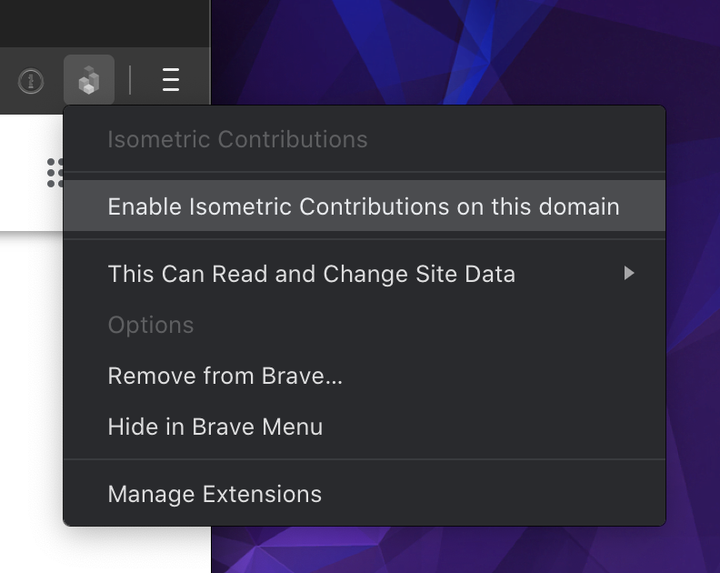

# GitHub 立体贡献图浏览器拓展程序

[英文版](https://github.com/jasonlong/isometric-contributions/blob/main/README.md) | 中文版

这是一个为 Chrome / Brave 和 Firefox 而量身打造的浏览器拓展程序，让你能够在 GitHub 用户档案页面的贡献图处，切换显示原生 2D 图与立体像素版贡献图。我们使用了 [obelisk.js](https://github.com/nosir/obelisk.js) 用于绘制立体图像。

除了看起来更整洁干净外，我们的立体图像还很是有趣。它以更高的精细度，突出显示了贡献数量之间的差异。但是这并不意味着完全替代标准2D图形，因为在大多数情况下，它其实也就是个花瓶。例如，图像没有轴标签，较短的条形图可能会被隐藏在较高的条形图后面，而且在我们将鼠标悬停在条形图上时候，我们无法查看到日期和计数等。

## 安装方式

### Chrome / Brave

[Install from the Chrome Web Store](https://chrome.google.com/webstore/detail/isometric-contributions/mjoedlfflcchnleknnceiplgaeoegien?hl=en&gl=US)

### Firefox

[Install from Mozilla Add-ons site](https://addons.mozilla.org/en-US/firefox/addon/github-isometric-contributions/)

#### GitHub Enterprise

默认情况下，这个拓展程序只会渲染 `github.com` 上的贡献图，而我们可以点击拓展程序图标，选择 `Enable Isometric Contributions on this domain`，手动让拓展程序能够在我们的 Enterprise 版域名上显示。

## 贡献

如果您想自定义扩展程序，那么你可能需要手动安装它。首先先克隆或分叉此仓库，然后，在 Chrome 扩展程序 页面上，选中 “开发人员模式，点击 “加载已解压缩的扩展程序……” 按钮，然后选定仓库所在的文件夹即可。

要自定义该扩展程序，首先需要确保已在开发人员模式下安装了该扩展程序（参见上文）。对扩展程序进行更改后，请返回 “扩展程序” 页面，然后单击扩展程序条目下的 “重新加载” 链接。

如果你有什么改进的内容，请随时打开一个拉取请求。

## 开源协议

本项目以 [MIT License](http://opensource.org/licenses/MIT) 协议开源。
