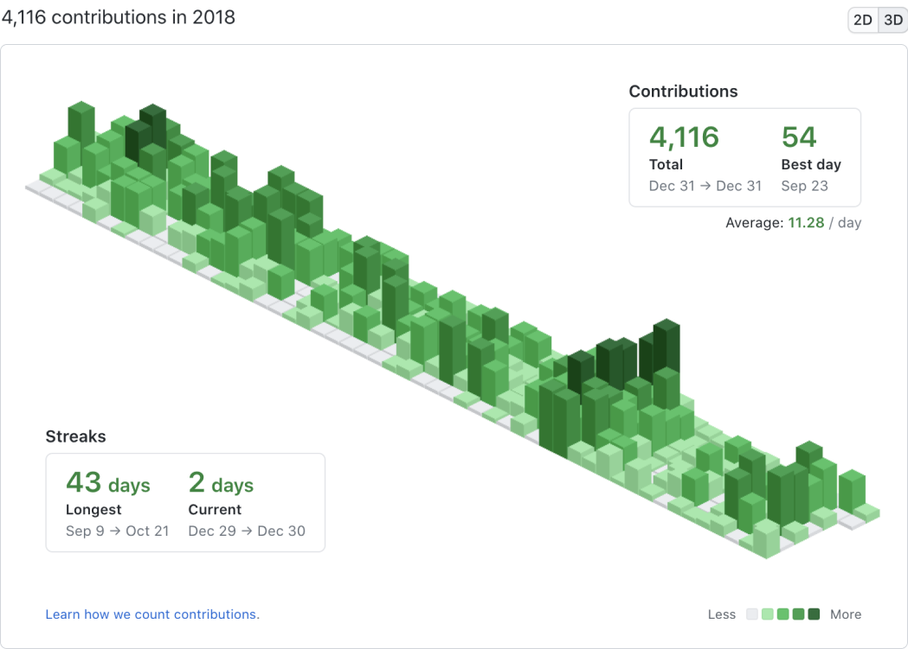
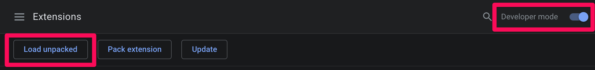
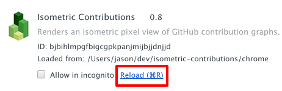

# GitHub Isometric Contributions extension

This is a browser extension for Chrome/Brave and Firefox that lets you toggle between your regular GitHub contribution chart and an isometric pixel art version. It uses [obelisk.js](https://github.com/nosir/obelisk.js) for the isometric graphics.

Besides being sort of neat looking, this view is interesting in that it highlights the differences between the number of contributions with more granularity. This isn't meant to completely replace the standard 2D graph though, because in most ways it is actually less useful. For example, there are no axis labels, shorter bars can be hidden behind taller ones, you can't hover over a bar to see the day and count, etc.

## Installation

### Chrome/Brave

[Install from the Chrome Web Store](https://chrome.google.com/webstore/detail/isometric-contributions/mjoedlfflcchnleknnceiplgaeoegien?hl=en&gl=US)

### Firefox

[Install from Mozilla Add-ons site](https://addons.mozilla.org/en-US/firefox/addon/github-isometric-contributions/)

### Microsoft Edge

[Install from Microsoft Edge Add-ons site](https://microsoftedge.microsoft.com/addons/detail/github-isometric-contribu/hcicbpfcbdpfgibhlbphodkcbojakpej)

## Contributing

**_Note that I don't currently have any plans for adding new features to the extension. Please contact me before submitting a PR with new functionality._**

If you want to hack on the extension, you'll need to install it manually. First clone or fork this repo. Then, on your Chrome Extensions page, make sure "Developer mode" is checked. You can then click the "Load unpacked extension..." button and browse to the `src` directory of this repo.

To hack on the extension, you'll first need to make sure you've installed it in Developer mode (see above). Once you've made changes to the extension, go back to the Extensions page and click the Reload link under the extension entry.

## License

This project is licensed under the [MIT License](http://opensource.org/licenses/MIT).
